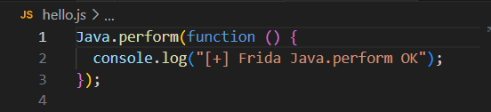
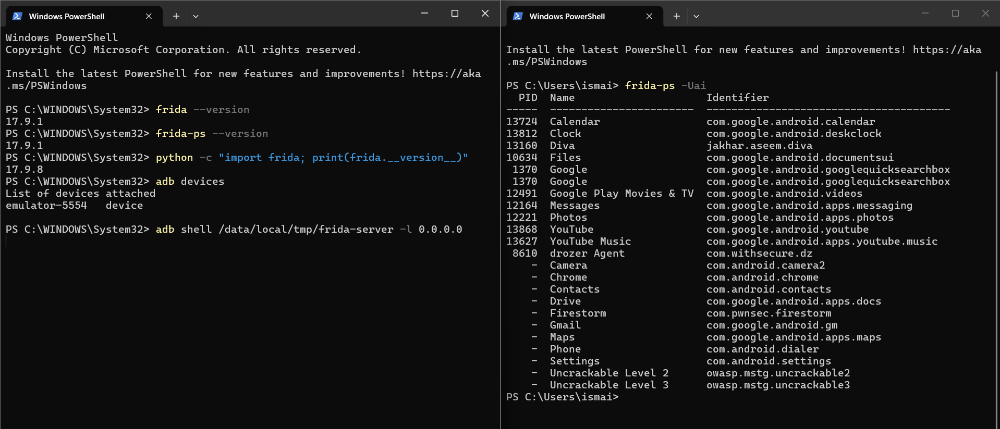
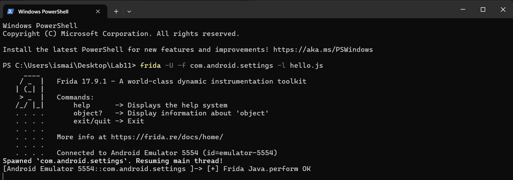
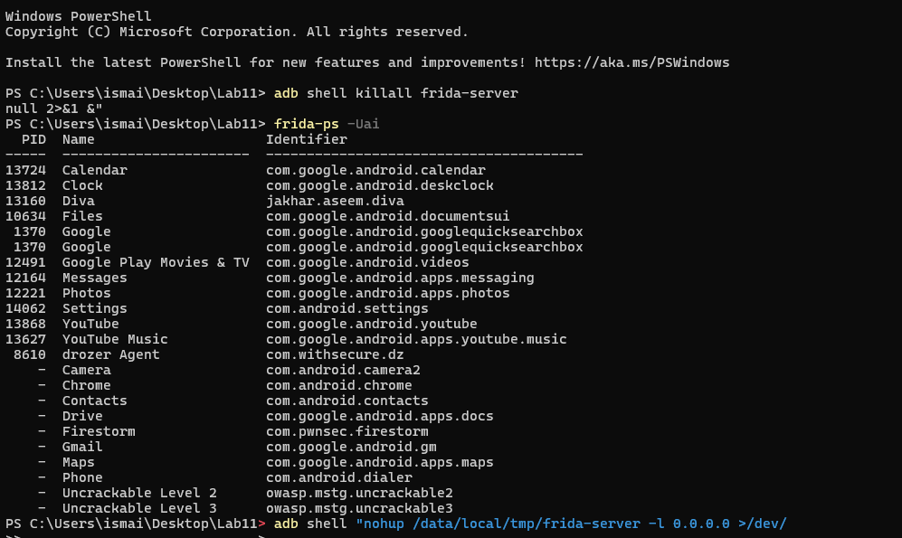

# Lab_10_MobileSecurity
# Rapport de Laboratoire : Déploiement et Instrumentation avec Frida (Lab 10)

## 1. Objectif du Laboratoire
Ce laboratoire a pour objectif principal de mettre en place un environnement d'analyse dynamique d'applications mobiles à l'aide du framework d'instrumentation **Frida**. Les activités visent à installer l'agent Frida sur un émulateur Android, à valider la communication entre l'hôte et le périphérique, et à réaliser une première injection de code JavaScript dans un processus en cours d'exécution.

## 2. Contexte Technique
L'analyse dynamique est une étape cruciale de la sécurité des applications mobiles. L'utilisation de Frida, fonctionnant sur une architecture Client-Serveur, permet d'interagir avec le runtime de l'application (Java et Natif), d'intercepter des appels systèmes, et de manipuler le comportement de l'application à la volée.

---

## 3. Déroulement et Preuves d'Exécution

### 3.1. Préparation de l'environnement et Validation de l'installation
Avant de procéder à l'injection, il est impératif de s'assurer de la présence et de la compatibilité des outils nécessaires (`frida-tools`, `python`, `adb`).
* **Action réalisée :** Vérification des versions de Frida, de Python, et confirmation de la détection de l'émulateur Android via le pont de débogage (ADB).
* **Preuve d'exécution :**
 

  

### 3.2. Déploiement du Serveur Frida sur Android
Afin d'établir la communication, le binaire `frida-server` (adapté à l'architecture de l'émulateur) a été poussé vers le répertoire `/data/local/tmp/`, rendu exécutable, puis lancé.
* **Action réalisée :** Lancement du serveur Frida en écoute sur l'interface locale (`0.0.0.0`) et test de communication en listant les processus actifs via `frida-ps -Uai`.
* **Preuve d'exécution :**
 

  

### 3.3. Validation de l'Injection de Code (Script Java)
L'étape de validation consiste à injecter un script basique pour vérifier la capacité de Frida à exécuter du code via l'API Java (`Java.perform`).
* **Action réalisée :** Création du fichier `hello.js` et injection dans le processus cible. La reprise de l'exécution (`%resume`) a permis de confirmer la bonne exécution du script.
* **Preuve d'exécution :**
 

  

### 3.4. Dépannage et Résilience
La gestion des pannes de l'agent fait partie intégrante du travail d'analyse.
* **Action réalisée :** Simulation d'une interruption du serveur (`killall frida-server`), diagnostic de l'erreur réseau engendrée, puis redémarrage du service en tâche de fond (`nohup ... &`).
* **Preuve d'exécution :**
 

  

---

## 4. Conclusion
L'ensemble des objectifs du laboratoire a été atteint. L'environnement de test est désormais pleinement opérationnel. La capacité à déployer l'agent de manière autonome, à lister les processus et à injecter des scripts d'instrumentation a été confirmée, établissant ainsi une base solide pour des analyses de sécurité plus approfondies (interception cryptographique, analyse réseau et manipulation du stockage local).
